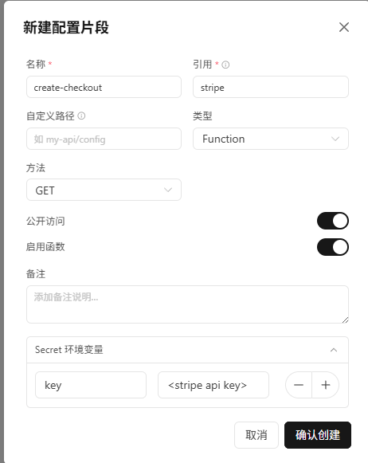
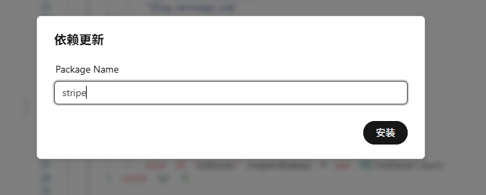
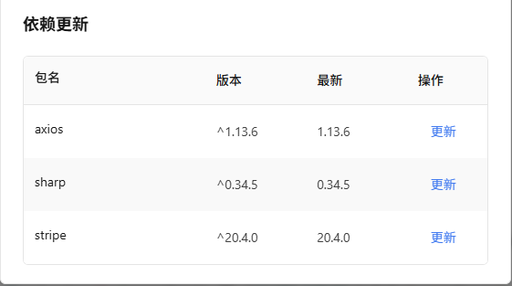

### 使用方法:

1. 添加[云函数](functions/create-checkout.ts)

> 名称: create-checkout
> 引用: stripe
> 数据类型: Function
> 请求方式: GET
> ecret：key 你的stripe api密钥




2. 安装依赖




检查:



> 当然,你也可以直接npm install stripe -g

### 参数说明

- 必填参数
    - `amount`：金额（单位：元）

- 可选参数
    - `currency`：币种，默认 `cny`
    - `return_url`：支付成功/取消后统一跳转地址（推荐传）
    - `success_url`：成功跳转地址（当未传 `return_url` 时可作为回退）
    - `cancel_url`：取消跳转地址（当未传 `return_url` 时可作为回退）

说明：当前函数会将 `success_url` 和 `cancel_url` 统一使用同一个返回地址，优先级为 `return_url` > `success_url` > `cancel_url` > 来源页面 URL。


### example：

```html
<input id="amount" type="number" value="10" min="1" step="0.01" />
<button id="pay">Pay</button>

<script>
    const API_URL = '/api/v2/fn/stripe/create-checkout';

    document.getElementById('pay').onclick = async () => {
        const amount = document.getElementById('amount').value;
        const query = new URLSearchParams({
            amount: String(amount),
            currency: 'cny',
            return_url: window.location.href
        }).toString();

        const res = await fetch(`${API_URL}?${query}`, { method: 'GET' });
        const data = await res.json();
        const url = data?.data?.url || data?.url;

        if (!res.ok || !url) {
            alert(data?.message || '创建支付失败');
            return;
        }

        window.location.href = url;
    };
</script>
```

